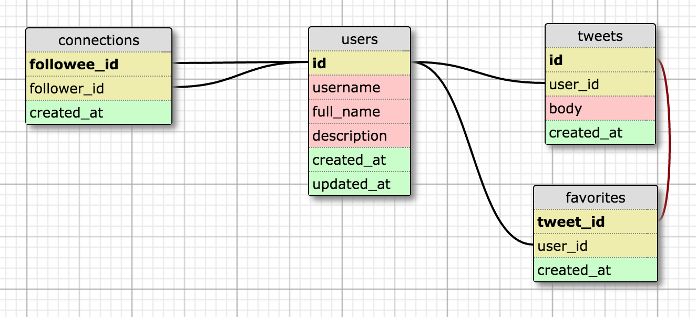

# Twitter System Design

## System Design Prompt

“Design a simplified version of Twitter where people can post tweets, follow other people and favorite tweets.”

## Clarifying Questions

If you're working through this problem by yourself or doing a mock interview with a friend, these are the answers that the interviewer would give to clarifying questions.

*Q: How many users do we expect this system to handle?*  
*A: You can expect to have 10 million users generating 100 million requests per day.*  

*Q: How many other users will the average person be following?*  
*A: We expect that each user will be following 200 other users on average, but expect some extraordinary users with tens of thousands of followers.*  

*Q: How many new tweets and new favorites can we expect each day?*  
*A: We expect that there will be a maximum of 10 million tweets per day and each tweet will probably be favorited twice on average but again, expect some big outliers.*  

## Resources

Abbreviations that I'll use in the solution:
  * B - billion 
  * M - million
  * GB - gigabyte 
  * TB - terabyte

## The Solution

### Step 1: Use Cases and Constraints

#### Use Cases

The first thing that we'll need to do is clarify the use cases.  It's also helpful to note which use cases are read operations and which use cases are write operations.

* Posting new tweets (write)
* Following a user (write)
* Favoriting a tweet (write)
* Displaying data about users and tweets (read)

Next we'll describe how the user will interact with the application so that we know you and the interviewer are on the same page. For example, there will be a profile page for each user, which will show us their latest tweets and will allow for older tweets to be shown. Each such page will have a button for following the user. There will also be a button at the top of the page, which will allow logged in users to open a dialog box and write a message in it. After they click a button the message will be stored and will appear on their profile page. 

#### Constraints

We need to ask some clarifying questions in order to nail down our constraints.

*Q: How many users do we expect this system to handle?*  
*A: You can expect to have 10 million users generating 100 million requests per day.*  

*Q: How many other users will the average person be following?*  
*A: We expect that each user will be following 200 other users on average, but expect some extraordinary users with tens of thousands of followers.*  

*Q: How many new tweets and new favorites can we expect each day?*  
*A: We expect that there will be a maximum of 10 million tweets per day and each tweet will probably be favorited twice on average but again, expect some big outliers.*  

To summarize:
  * 10M users
  * 10M tweets per day
  * 20M tweet favorites per day
  * 100M requests per day
  * 2B “follow” relations (10M tweets * 200 followers/following = 2B edges)
  * Some users and tweets could generate an extraordinary amount of traffic

##### Load
100M total requests/day => 1150 req/second

10M tweets/day => 115 tweets/second
20M favorites/day = > 230 favorites/second

This traffic will be distributed unevenly throughout the day so the system should be able to handle at least a few thousand requests per second.

##### Data

Storing the tweets:

10M tweets/day => 3.65 tweets/year
Let's aim for a solution that can efficiently store 10B tweets
Let's assume that each tweet will be 140 characters.
1 char = 1 byte 
10B tweets * 140 bytes/tweet = 1.4 TB  

Storing the "follow" relations:

2B follow relations
Each relation will contain two user ids (the follower and the followee)
Let's make each user id 4 bytes, so each follow relation will be 8 bytes
8 bytes * 2B = 16B bytes = 16 GB

Storing the favorites: 

20M favorites/day => 7.3B favorites/year
Let's aim for a solution that can efficiently store 20B favorites
A favorite will consists of a user id and a tweet id
User ids are 4 bytes each
Tweet ids are 8 bytes each
Each favorite will be 12 bytes
12 bytes * 20B = 240B bytes = 240 GB

Total required storage capacity = 1.4 TB + 16 GB + 240 GB = ~2.7 TB

### Step 2: Abstract Design & Bottlenecks

#### Abstract Design

Our backend can be divided into two seperate layers.  The application service layer and the database layer.

Application Service Layer
  * Handles all incoming requests
  * Sends read and write requests to the database

Database Layer
  * Writes
    * Post a tweet
    * Follow a user
    * Favorite a tweet
  * Reads
    * Fetch a user's profile data
    * Fetch tweets for a user
    * Fetch followers for a user
    * Fetch who a user is following
    * Fetch who has favorited a tweet 

#### Bottlenecks
Our application service layer is very light weight since we don't need to do any type of computationally expensive processing.  It's essentially just a wrapper for our database queries.  

Our bottlenecks are going to occuring in the database layer.
 
### Step 3: Data Model and API Design

#### Schema Design
The data for our Twitter clone is highly relational, so we'll be using a relational database in our solution.  This is an example of the schema that you might design for a simplified Twitter clone.

#### Indexes  

Now that we know what out database schema is going to look like, we need to think about what queries will be sent to our database.  This will allow us to create indexes that will optimize our lookup times. 

To get the user data for for a given username we can index by username.   

When we view someone's profile we'll want to see their 20 most recent tweets. This means that we could use a query, which not only filters by user_id but also orders by creation date (`created_at`) and limits the result.  We can accomplish this by creating an index that includes the `user_id` and `created_at` columns.  When we have an index over more than one column the order of the columns matters. If our index looks like this: (`user_id`, `created_at`), making a query filtering by just `user_id` will take advantage of the index even though we are not filtering by the second column.So, such an index will allow us to filter either by just user_id, or by both columns. This will allow us to fetch all tweets authored by a given user or to isolate just the tweets created in a given time frame.      

To get the users following someone we can index by `followee_id`.   
To get the users followed by someone we can index by `follower_id`.  

If we want to fetch the tweets that a user has favorited, we will need to join `favorites` with `tweets` and to filter by `user_id`. The columns used for joining will be the `tweet_id` in  `favorites` and the `id` in `tweets`.
The above means that it makes sense to add two indexes - one on the `user_id` column and one on the `tweet_id` column.

Table | Indexes 
--- | --- | ---
users | username
tweets | user_id, created_at
connections | followee_id   follower_id
favorites | user_id   tweet_id

#### API Design
We'll be building a RESTful API for our solution.  Here are the endpoints that we will use.

Fetching profile data for a user  
`GET /api/users/:username`

Fetch tweets for a given user that are ordered by date  
`GET /api/users/:username/tweets`  

We also will want to specify a query parameter to fetch older tweets.  In this example, we're saying that we want to fetch tweets that occur before the timestamp '2016-11-03+20:02:33.02819Z'.  
`GET /api/users/:username/tweets?before=2016-11-03+20:02:33.02819Z`

Fetch a users followers  
`GET /api/users/:username/followers`  

Fetch who a user is following  
`GET /api/users/:username/following`  

Sending a tweet  
`POST /api/users/:username/tweets`  

Following a user  
`POST /api/users/:username/followers`  

Favoriting a tweet  
`POST /api/users/:username/tweets/:tweet_id/favorites`

Fetch all of the users that have favorited a tweet  
`GET /api/users/:username/tweets/:tweet_id/favorites`

### Step 4: Scalable Design

